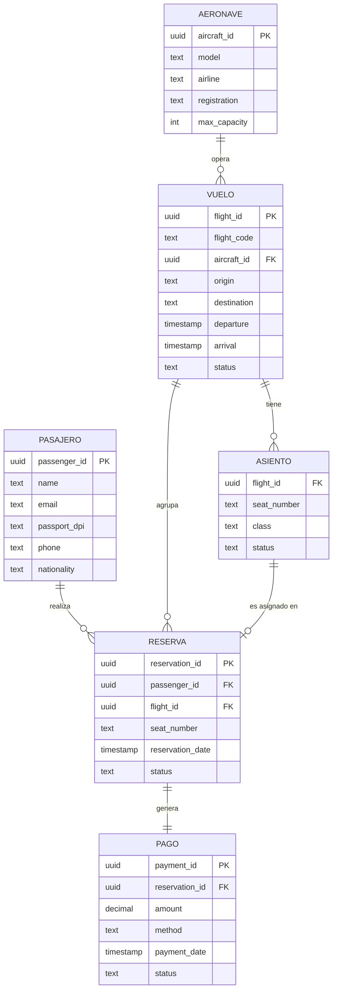

# Fase 1 — Análisis de Requerimientos y Modelado Conceptual

> **Proyecto:** Sistema de Gestión de Reservas y Boletos Aéreos  
> **Paradigma:** Query-Driven Modeling para Apache Cassandra  
> **Principio fundamental:** En Cassandra, primero se definen las consultas, luego se diseñan las tablas.

---

## 1. Entidades del negocio y sus atributos

### 1.1 Pasajero
Representa a la persona que puede reservar y comprar boletos de avión.

| Atributo | Tipo | Descripción |
|---|---|---|
| `passenger_id` | UUID | Identificador único (PK) |
| `name` | TEXT | Nombre completo |
| `email` | TEXT | Correo electrónico (único) |
| `passport_dpi` | TEXT | Número de pasaporte o DPI |
| `phone` | TEXT | Teléfono de contacto |
| `nationality` | TEXT | Nacionalidad del pasajero |

### 1.2 Aeronave
Avión utilizado para operar los vuelos.

| Atributo | Tipo | Descripción |
|---|---|---|
| `aircraft_id` | UUID | Identificador único (PK) |
| `model` | TEXT | Modelo del avión (ej. Boeing 737) |
| `airline` | TEXT | Aerolínea operadora |
| `registration` | TEXT | Número de matrícula |
| `max_capacity` | INT | Capacidad máxima de pasajeros |

### 1.3 Vuelo
Trayecto programado entre dos aeropuertos.

| Atributo | Tipo | Descripción |
|---|---|---|
| `flight_id` | UUID | Identificador único (PK) |
| `flight_code` | TEXT | Código de vuelo (ej. AV-205) |
| `aircraft_id` | UUID | Referencia a la aeronave (FK conceptual) |
| `origin` | TEXT | Aeropuerto de origen (código IATA) |
| `destination` | TEXT | Aeropuerto de destino (código IATA) |
| `departure` | TIMESTAMP | Fecha y hora de salida |
| `arrival` | TIMESTAMP | Fecha y hora de llegada |
| `status` | TEXT | Estado: `programado`, `retrasado`, `cancelado`, `completado` |

### 1.4 Asiento
Unidad de capacidad de un vuelo específico.

| Atributo | Tipo | Descripción |
|---|---|---|
| `flight_id` | UUID | Vuelo al que pertenece (FK conceptual) |
| `seat_number` | TEXT | Número de asiento (ej. 14A) |
| `class` | TEXT | Clase: `economica`, `ejecutiva`, `primera` |
| `status` | TEXT | Estado: `disponible`, `ocupado`, `bloqueado` |

### 1.5 Reserva
Registro de la intención de un pasajero de ocupar un asiento.

| Atributo | Tipo | Descripción |
|---|---|---|
| `reservation_id` | UUID | Identificador único (PK) |
| `passenger_id` | UUID | Pasajero que reserva (FK conceptual) |
| `flight_id` | UUID | Vuelo reservado (FK conceptual) |
| `seat_number` | TEXT | Asiento asignado |
| `reservation_date` | TIMESTAMP | Fecha de creación de la reserva |
| `status` | TEXT | Estado: `pendiente`, `confirmada`, `cancelada` |

### 1.6 Pago
Transacción económica asociada a una reserva.

| Atributo | Tipo | Descripción |
|---|---|---|
| `payment_id` | UUID | Identificador único (PK) |
| `reservation_id` | UUID | Reserva asociada (FK conceptual) |
| `amount` | DECIMAL | Monto del pago |
| `method` | TEXT | Método: `tarjeta`, `transferencia`, `efectivo` |
| `payment_date` | TIMESTAMP | Fecha del pago |
| `status` | TEXT | Estado: `pendiente`, `pagado`, `reembolsado` |

---

## 2. Relaciones entre entidades

| Relación | Cardinalidad | Descripción |
|---|---|---|
| Pasajero → Reserva | 1:N | Un pasajero puede tener múltiples reservas |
| Vuelo → Asiento | 1:N | Un vuelo tiene múltiples asientos |
| Vuelo → Reserva | 1:N | Un vuelo puede tener múltiples reservas |
| Reserva → Pago | 1:1 | Cada reserva tiene exactamente un pago |
| Aeronave → Vuelo | 1:N | Una aeronave puede operar múltiples vuelos |
| Asiento → Reserva | 1:1 | Un asiento de un vuelo solo se asigna a una reserva activa |

---

## 3. Reglas de negocio

1. **Unicidad de asiento:** Un asiento de un vuelo específico solo puede estar asignado a un pasajero a la vez.
2. **Cancelación con límite temporal:** Las reservas pueden modificarse o cancelarse hasta 24 horas antes de la salida.
3. **Control de sobreventa:** El número de reservas confirmadas no puede superar `max_capacity` de la aeronave asignada.
4. **Pago obligatorio:** Cada reserva debe tener asociado un pago con estado correspondiente.
5. **Cancelación en cascada:** Si un vuelo es cancelado, todas las reservas y pagos asociados cambian de estado.
6. **Consultas agregadas:** El sistema debe responder consultas de ocupación e ingresos sin calcular en el cliente.

---

## 4. Diagrama Entidad-Relación (Conceptual)

---

## 5. Identificación de las 5 consultas críticas del negocio

> Esta es la etapa más importante del diseño en Cassandra.
> **Las tablas se diseñan a partir de estas queries, no al revés.**

---

### Q1 — Disponibilidad de asientos por clase
**Descripción del negocio:** Mostrar en tiempo real cuántos asientos están disponibles y ocupados por clase para un vuelo específico.

**Pregunta exacta:**
> Para el vuelo `X`, ¿cuántos asientos hay en estado `disponible` y `ocupado` desglosado por `economica`, `ejecutiva` y `primera`?

**Restricciones de diseño:**
- [X] No puede contarse haciendo `SELECT COUNT(*) ... WHERE flight_id = X AND class = Y AND status = Z` (sería lento con 200 filas por vuelo y miles de vuelos)
- [OK] Debe mantenerse una **tabla de COUNTER** que se actualiza incrementalmente en cada reserva/cancelación

**Patrón de acceso:** `flight_id` → `class`, `status` → `count`

---

### Q2 — Historial cronológico de un pasajero
**Descripción del negocio:** Un pasajero consulta todos sus vuelos y reservas dentro de un rango de fechas, con el estado de pago de cada una.

**Pregunta exacta:**
> Para el pasajero `P`, entre `fecha_inicio` y `fecha_fin`, ¿cuáles son sus reservas ordenadas cronológicamente, incluyendo vuelo, asiento, clase, estado de reserva y estado de pago?

**Restricciones de diseño:**
- [X] No puede hacerse con JOIN entre reservas y pagos
- [X] No puede usarse ALLOW FILTERING sobre `reservation_date`
- [OK] Tabla denormalizada con `passenger_id` como Partition Key y `reservation_date` como Clustering Key, con datos de pago incluidos en la misma fila

**Patrón de acceso:** `passenger_id` + rango de `reservation_date` → listado ordenado

---

### Q3 — Manifiesto de vuelo enriquecido
**Descripción del negocio:** El personal de tierra necesita la lista completa de pasajeros de un vuelo, ordenada por número de asiento, con clase, estado de reserva y estado de pago — todo en una sola consulta.

**Pregunta exacta:**
> Para el vuelo `X`, ¿cuál es el listado de pasajeros ordenado por número de asiento, con su clase, estado de reserva y estado de pago?

**Restricciones de diseño:**
- [X] No puede hacerse con JOIN entre pasajeros, reservas y pagos
- [OK] Tabla denormalizada con `flight_id` como Partition Key y `seat_number` como Clustering Key, con datos de pasajero, reserva y pago en la misma fila

**Patrón de acceso:** `flight_id` → listado ordenado por `seat_number`

---

### Q4 — Porcentaje de ocupación por ruta y rango de fechas
**Descripción del negocio:** Para una ruta específica (origen → destino), calcular qué porcentaje de la capacidad de cada vuelo fue ocupado dentro de un período.

**Pregunta exacta:**
> Para la ruta `GUA → MEX`, entre `fecha_inicio` y `fecha_fin`, ¿cuántas reservas confirmadas tiene cada vuelo en relación a la capacidad máxima de su aeronave?

**Restricciones de diseño:**
- [X] Las particiones por ruta podrían volverse enormes si contienen todos los vuelos históricos
- [OK] Bucketing por ruta + mes (`GUA-MEX_2026-09`) para controlar el tamaño de las particiones
- [OK] COUNTER para reservas confirmadas, capacidad almacenada en tabla auxiliar

**Patrón de acceso:** `(route, bucket)` + rango de `departure` → `confirmed_count`, `capacity`

---

### Q5 — Top N vuelos por ingresos generados
**Descripción del negocio:** Ranking de los vuelos más rentables dentro de un período, ordenados de mayor a menor ingreso.

**Pregunta exacta:**
> Para el mes `2026-09`, ¿cuáles son los 10 vuelos con mayor ingreso total por pagos confirmados?

**Restricciones de diseño:**
- [X] No puede calcularse sumando pagos en el cliente (sería escanear toda la tabla)
- [X] Los COUNTER no funcionan con DECIMAL (montos no son enteros)
- [OK] Tabla de agregación con `period` como Partition Key y `total_revenue` como Clustering Key en orden DESC, actualizada con cada pago confirmado mediante upsert
- [OK] El `LIMIT N` se resuelve directamente en CQL sin ordenar en el cliente

**Patrón de acceso:** `period` → primeras N filas ordenadas por `total_revenue DESC`

---

## 6. Resumen del análisis: Queries → Estrategia de tabla

| Query | Partition Key | Clustering Key | Patrón especial |
|---|---|---|---|
| Q1 — Disponibilidad | `flight_id` | `class`, `status` | COUNTER |
| Q2 — Historial pasajero | `passenger_id` | `reservation_date` DESC | Tabla denormalizada, rango de fechas |
| Q3 — Manifiesto vuelo | `flight_id` | `seat_number` ASC | Tabla denormalizada (3 entidades) |
| Q4 — Ocupación por ruta | `(route, bucket)` | `departure`, `flight_id` | Bucketing + COUNTER |
| Q5 — Top ingresos | `period` | `total_revenue` DESC | Tabla de agregación + upsert |

> **Nota sobre RF y CL:**  
> El clúster tendrá Replication Factor = 3 con NetworkTopologyStrategy.  
> Las queries de escritura usarán `CONSISTENCY QUORUM` (2 de 3 nodos).  
> Las queries de lectura usarán `CONSISTENCY ONE` en modo normal y `QUORUM` en modo crítico.

---

## 7. Checklist Fase 1 [OK]

- [x] Entidades identificadas con todos sus atributos
- [x] Relaciones y cardinalidades definidas
- [x] Reglas de negocio documentadas
- [x] Diagrama ER conceptual creado (Mermaid)
- [x] Las 5 queries del negocio identificadas y descritas
- [x] Estrategia de modelado definida para cada query
- [x] Justificación de Partition Key y Clustering Key por query

**Siguiente paso → Fase 2:** Diseño del modelo lógico: crear las tablas CQL especializadas para cada query.
